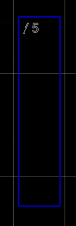

# Gitamatic – User Guide

---

## 1. What is Gitamatic?

**Gitamatic** is a mobile application designed for guitarists, music enthusiasts, and anyone who wants to easily create and edit their compositions directly on their phone. 

Unlike traditional tablature editors, Gitamatic offers a fresh approach to displaying and organizing notes — inspired by the interfaces of desktop digital audio workstations (DAWs).

The app combines multiple types of notation editors in a single, intuitive interface, allowing users to compose and edit guitar parts quickly and effortlessly.

### 1.1 Key Features:

- Customizable falling-note visualization
- Adjustable colors, sizes, and visual effects
- Optimized for both personal use and sharing on social media

Gitamatic is built with a clear niche in mind: guitarists — especially solo players and fingerstyle performers. While DAWs, music games, and tools like guitar tuners all belong to the same musical ecosystem, they serve very different purposes. Gitamatic aims to bring together the most exciting and demanding aspects of guitar playing — all in one place: gameplay, progress tracking, learning tools, customizable settings, useful content, and everything else a guitarist might need.

Our mission goes beyond just introducing new features — we strive to deliver innovative tools that truly matter to our users. Gitamatic is built around community feedback and focused on providing meaningful functionality that supports creativity, learning, and artistic growth.

---

## 2. What is Guitar Tablature?

**Guitar tablature** (or simply *tab*) is a simplified form of musical notation used primarily for string instruments, especially the guitar. 

Unlike traditional sheet music, tablature doesn't require knowledge of music theory or the ability to read standard notation, which makes it especially popular among beginners and self-taught guitarists.

### 2.1. How does tablature work?

Tablature is a text-based system that indicates which strings to play and which frets to press in order to produce a melody or chord. 

Unlike classical notation, it visually represents finger positions on the fretboard, making it much easier to understand and follow.

Here's an example of a simple guitar tab:

Each line represents a guitar string (from high *e* at the top to low *E* at the bottom). The numbers indicate which fret to press on the corresponding string.

For example:
- On the **D** string (4th from the bottom), play the **2nd fret**
- On the **G** string (3rd from the bottom), play **2nd fret**
- On the **B** string (2nd from the bottom), play **1st fret**

This kind of notation allows you to quickly understand finger placement without needing to read notes.

### 2.2. ✅ Advantages of Tablature

- **Easy to understand** – You don't need to know about sharps, flats, or note durations to start playing music from tabs.
- **Highly applicable** – Works for both simple rhythm patterns and complex solos.
- **Versatile** – Used in all music genres: classical, jazz, rock, and more.
- **Creative tool** – A convenient way to capture and develop your own musical ideas.

### 2.3. ⚠️ What Tablature Shows — and What It Doesn’t

Tablature tells you **where to place your fingers** on the fretboard, but it **does not** show:

- Note duration (how long to hold a note)
- Rhythm or timing
- Dynamics (how loud or soft to play)
- Technique details (legato, slides, bends, etc. — sometimes noted, but not always clearly)

Because of these limitations, tabs are often used alongside **audio or video recordings**, helping guitarists understand how a piece is meant to sound.

---

### 2.4. Types of Tablature

- **Melody (Solo) Tabs**  
  Display each note individually, string by string.

- **Chord Tabs**  
  Include chord names above the tablature to indicate harmonic structure.

- **Lyrics with Chords**  
  Combine song lyrics and chord symbols to show when to change chords as you sing.

---

### 2.5. Why Is Tablature Important?

For most guitarists, tablature is the **first step** to learning the instrument. It allows you to:

- Quickly start playing your favorite songs  
- Train your fingers and memorize fretboard positions  
- Create and share your own parts  
- Store musical ideas in a simple, readable format

---

### 2.6. How Tablature Works in Gitamatic

In Gitamatic, tablature is not just plain text — it’s an **interactive, multimedia tool**, fully integrated into the app’s visual and functional design.

### 2.7 🔍 Key Interactive Features:

- **Fretboard Visualization**  
  When you open a tab, Gitamatic displays real-time fretboard positions, showing exactly where to place your fingers.

- **Note Animation**  
  Each note is animated as it plays, helping you follow the correct sequence and finger movements.

- **Audio + Video Playback**  
  Tabs include synchronized sound and optional playback, so you don’t just read — you also hear and feel the rhythm.

---

### 2.8 🎸 Tablature as a Bridge Between Text and Sound

While tablature is essentially text-based, Gitamatic turns it into a powerful experience thanks to:

- 🎨 **Visuals** – Interactive guitar neck with live finger positions  
- 🔊 **Sound** – Real-time playback linked with each note  
- 🎞️ **Motion** – Animated finger movements following the music

---

> In Gitamatic, tablature isn’t just a way to write down music — it’s a digital language that connects the guitarist with their instrument through sight, sound, and motion.

## 3. App Navigation

### 3.1 First Launch

When you open Gitamatic for the first time, there are no compositions yet.  

Simply tap the **Add** button to create your first composition.  
  

A dialog will appear prompting you to enter the **composition name**.  
Tap **Create** to proceed.  
  

Once created, your new composition will open immediately.

---

### 3.2 Composition List

If you already have compositions, Gitamatic will open directly into the **Composition List**.  
At the top, you'll see the Gitamatic logo and a **menu icon** on the right.  

---

### 3.3 Navigation Menu Options

Accessible from the top-right menu:

- **Create** – Create a new composition  
- **Settings** – General app settings  
- **About** – Short description about Gitamatic  

---

### 3.4 Composition Cards in the List

Each composition is displayed as a card with:

- **Play button**  
- **Composition name**  
- **Duration**  
- **Last modified date & time**  

When tapping **Play**, the composition begins playback:  
- The **Pause** button replaces Play  
- A real-time timer and progress bar appear  

---

### 3.5. Editing a Composition

A composition opens in the **Editor View**, which includes a top action bar and the main note editor.  

#### 3.5.1 Top Action Bar  

##### 3.5.1.1 Back Navigation  
Tap to return to the composition list  

##### 3.5.1.2 Composition Title  
Displays the name of the current composition  

##### 3.5.1.3 Play / Stop Button  
Controls playback of the current composition  

##### 3.5.1.4 Composition Menu  
Opens a dropdown with the following options:  
  

- **Layout Design** – Configure visual layout and style  
- **Rename** – Rename the current composition  
- **Save As** – Duplicate composition  
- **Delete** – Remove the current composition  
- **Help [?]** – Access help linked to this guide  

---

#### 3.5.2. Working with Notes – Layout Mode

Gitamatic offers two main editing modes: **Layout Mode** and **Grid Mode**

#### 3.5.2.1. Selecting Layout Mode

Tap the icon with three vertical bars.  
It becomes active (highlighted in blue).  

---

#### 3.5.2.2. Editor Layout Mode

The editor grid contains:
- **6 vertical columns** representing the 6 strings of an acoustic guitar
- **Infinite horizontal rows** for note progression, as a composition can be of any length  

---

#### 3.5.2.3. Selecting a Cell

Tap any cell to highlight it with a **yellow indicator**.  
From there, you can:

1. **Create a new note**  
2. **Edit an existing note**  
3. **Delete the note**  

#### 3.5.2.3. Scrolling the Editor

To navigate vertically in the composition — from the beginning to later moments — simply **scroll with your fingers**.  
On the right side, the **time ruler** helps you see the current position.  
In the example below, the selected cell is approximately at second 32.  

---

#### 3.5.2.4. Adding a New Note

To add a new note, either:
- **Double-tap** a cell quickly  
- Or **press and hold** for ~2 seconds

A note configuration window will open:  
- Set the parameters  
- Tap **Save** to confirm or **Cancel** to discard  

The created note appears as a **vertical rectangle**:
- It spans nearly the full width of a column  
- Its height represents duration (default: ~3 seconds)  

---

#### 3.5.2.5. Editing a Note

To edit an existing note, **double-tap** it.  
This opens the same configuration window as for a new note.  

#### 3.5.2.6. Note Parameters

##### 3.5.2.6.1 Volume
- Adjustable from **0% (min)** to **100% (max)**
- Available via input field and slider  

##### 3.5.2.6.2 Duration
- Maximum: **3 sec (3000 ms)**  
- Minimum: **0 sec**
- Editable with the same type of controls as volume  

##### 3.5.2.6.3 Note Start Position
- Set the note's start time using a numeric input  

##### 3.5.2.6.4 Note Level (Fret)
- Select the fret number (0–21) on the selected string  
- For example: **String 4, fret 5**  

---

#### 3.5.2.7 Deleting a Note

To delete a note:
1. Double-tap the note  
2. In the edit panel, tap the small **X icon (delete)**  
3. The note will be removed from the composition  

---

#### 3.5.2.8 Moving a Note

To move a note interactively:
1. **Tap and hold** the note for ~2 seconds until it turns **bright blue**  
2. **Drag** the note up or down to change string position  
- First image: note is idle  
- Second image: note is selected  

---

### 3.5.3 Working with Tabs – Grid Mode

To switch to **Grid Mode**, tap the round button with **four small squares** inside.  
It becomes active with a **blue background**.  

Grid Mode offers a more structured, notation-like editing format — closer to traditional sheet music, though simplified.

Like in Layout Mode, you:
- Tap cells to **add**, **edit**, or **delete** notes  
- Each note occupies only **one cell**, similar to **text-based tab editors**, but enhanced

**Example of plain-text tablature:**

In Gitamatic’s **Grid Mode**, this looks cleaner and interactive:  

---

#### 3.5.3.1 Editing Notes in Grid Mode

Double-tap any note to open the configuration window:  

##### 3.5.3.1.1 Dynamics

Dynamics define the **intensity** of a note.  
Standard notation symbols include:

- `ppp` – very, very soft  
- `pp` – very soft  
- `p` – soft  
- `mp` – moderately soft  
- `mf` – moderately loud  
- `f` – loud  
- `ff` – very loud  
- `fff` – extremely loud  

---

##### 3.5.3.1.2 Duration

Musical note durations (fractions):

- Whole note (1)  
- Half note (1/2)  
- Quarter note (1/4)  
- Eighth note (1/8)  
- Sixteenth (1/16)  
- Thirty-second (1/32)  
- Sixty-fourth (1/64)

The smaller the fraction, the shorter and faster the note.  
Example: note set to **1/8 duration**  

---

##### 3.5.3.1.3 Note Level  
Set the fret number (like in Layout Mode)  

---

##### 3.5.3.1.4 Deleting a Note in Grid Mode  
Tap the **Remove** button at the bottom of the note dialog  

---

#### 3.5.3.2 Rhythm Settings

To configure rhythm:

1. Tap the **Rhythm Settings button**  
2. A configuration window appears  
  

##### 3.5.3.2.1 Base Configuration (Index 0)

The **first configuration** cannot be deleted — it represents the **starting point** of the composition.  
However, both **Tempo** (BPM) and **Ticks Per Beat** (TPB) can be edited.  
- The **Index** is always `0` and defines the beginning of the composition.

###### 3.5.3.2.1.1 How it works:
- **Tempo** (BPM) defines how fast the beats are played in real time.
- **TPB** (Ticks Per Beat) defines how many precise subdivisions each beat has.

**Example:**
At `120 BPM` and `480 TPB`:
- A quarter note lasts **500 ms**
- 1 tick ≈ **1.041 ms**  
This allows for high-resolution note placement and playback precision.

---

##### 3.5.3.2.2 Add New Tempo/Ticks Configuration

Tap the **plus button** to create a new configuration block:  

**Fields to enter:**
- **Tick Index** – the tick where the new configuration begins
- **Tempo (BPM)** – speed of the beat
- **TPB** – ticks per beat

**Example:** If `Index = 50`, `Tempo = 120`, `TPB = 16`, the new configuration applies starting at tick 50, until another configuration replaces it — or indefinitely.  

---

##### 3.5.3.2.3 Delete Tempo/Ticks Configuration

To remove a configuration:
1. Tap the **minus button** on the left side of the config row  
2. Tap **Save** to confirm  

---

### 3.5.4 Layout Mode ↔ Grid Mode Sync

Both **Layout Mode** and **Grid Mode** display the **same notes**, just in different visual formats.

#### 3.5.4.1 Key Sync Behaviors:

1. **Notes added in Grid Mode** appear in **exact alignment** with the timeline bar in Layout Mode.  
2. **Notes added in Layout Mode** align visually with the timeline, but in Grid Mode their tick position is approximated to the **nearest index value**, based on internal time calculation.

---

### 3.5.5 Custom Design – Layout Mode Only

To personalize how your compositions are displayed during playback, Gitamatic includes a **Design System**.

Accessible from:  
**Top Menu → Layout Design**

If no custom designs exist, only the default **Gitamatic (Built-in)** design will appear.  
> This default design is read-only and serves as a base template for creating new ones.

---

#### 3.5.5.1 Creating a New Design

1. Tap the **plus button** to add a new layout design  

2. A new window opens with multiple customization parameters  

3. Scroll to view all options (not all settings fit on one screen)  

---

### 3.5.6 General Settings

Accessible from the **main menu** (in the composition list screen).  
Tap **Settings** to open the following options:  

---

#### 3.5.6.1 Language Selection

Gitamatic supports **two languages**:
- English *(default)*
- German *(automatically activated if the device language is set to German)*

You can manually switch language by tapping the **Language** option:  

---

#### 3.5.6.2 Participate in Development

Enable this option to **help improve Gitamatic**.  
When activated, the app will send anonymized technical logs to our server to help us debug and improve the app experience.

---

#### 3.5.6.3 Enable Notifications

Turn this ON to **receive important notifications**:
- App updates
- Feature announcements
- Events and tips  

## 4. Installation and Updates

### 4.1 How to Install Gitamatic?
- Currently, Gitamatic is available only for devices running the Android operating system.
- Open Google Play, search for **“Gitamatic”**, and install the app.
- After installation, open the app and create an account or log in if you already have one.

### 4.2 Planned Versions
- In the near future, Gitamatic will be released for iOS, macOS, and desktop platforms (Windows, Linux).
- We will announce these updates separately via notifications and on our website.

### 4.3 Minimum System Requirements (Android)
- Android 7.0 or higher.
- At least **1.5 GB** of free RAM.
- Internet access (required for registration and updates).

### 4.4 How to Update Gitamatic?
- Updates are available through **Google Play**.
- Simply open the store, find **Gitamatic**, and tap “Update” if a new version is available.
- We recommend updating the app regularly to access new features and improvements.

### 4.5 What to Do If Installation or Update Fails?
If installation or update does not complete successfully:
- Check your internet connection quality.
- Make sure there is enough free storage space on your device.
- Restart your device and try again.
- If the problem persists, contact support and provide:
  - Your device model
  - Android version
  - Error description

## 5. Feedback

User feedback is a key element for the development and improvement of the Gitamatic app. We value every opinion and are ready to consider your suggestions, comments, and ideas to make the service as convenient, useful, and high-quality as possible.

### 5.1 Why is feedback important?
- Helps identify bugs and issues. Even the most carefully developed software can contain bugs that only become apparent during active user use.
- Allows understanding real needs. Your wishes help create features that guitarists of all levels really need.
- Contributes to development and implementation of new features. Thanks to your feedback, we can improve the interface, add useful tools, and optimize the app’s performance.

### 5.2 How to leave feedback?
- **Inside the app:** Use the built-in feedback feature or visit the “Support” section.
- **Email:** Write to our official support email [insert email], indicating the subject and content of your message.
- **Social media:** We are open to dialogue on our accounts — you can leave a comment or send a private message.
- **Forms and surveys:** Periodically, we conduct user surveys to gather opinions on specific features or updates.

### 5.3 What should you include in your feedback?
- A brief description of the problem or suggestion.
- Device and app version details (if it’s a technical issue).
- Screenshots, videos, or links — if possible, to demonstrate the situation.
- Your contact information for feedback (if you want a reply).

### 5.4 Processing and use of feedback
All received feedback is carefully reviewed by our team. We categorize messages into bugs, improvement suggestions, feature requests, and general comments. Priority is given to critical issues and the most requested features.

### 5.5 Thank you for participating
Every user who shares their opinion helps make Gitamatic better. We thank you for your activity and trust, promising to maintain dialogue and create a quality product that inspires playing and growth.

## 6. Troubleshootings

During the use of the Gitamatic app, users may encounter various technical or functional difficulties. Below are the most common problems and recommendations for their resolution:

### 6.1 Problems with app loading and startup
- **Cause:** Unstable internet connection or server issues.
- **Solution:** Check your internet connection, try restarting the app. If the problem persists, wait for a while — there may be technical maintenance on the server.

### 6.2 Slow performance or freezing
- **Cause:** Device overload or lack of free memory.
- **Solution:** Close other apps, free up RAM, restart the device. Update the app to the latest version.

### 6.3 Problems with displaying tablatures
- **Cause:** Incorrect data loading or interface bug.
- **Solution:** Try refreshing the page or restarting the app. If the error repeats, contact support with a detailed description.

### 6.4 Errors during audio or video playback
- **Cause:** Format incompatibility or audio device issues.
- **Solution:** Check the sound settings on your device, make sure drivers are updated. Try using headphones or external speakers.

### 6.5 Recommendations for contacting Gitamatic support
If you encounter a problem that you cannot solve on your own, we recommend:
- Describing the problem in detail, indicating the steps that lead to the error.
- Attaching screenshots or videos demonstrating the error.
- Specifying the device model, operating system version, and app version.

This will help our specialists assist you faster and more accurately.

## 7. FAQ (Frequently Asked Questions)

This section includes answers to the most common questions about the Gitamatic app.  
If you don’t find the information you’re looking for, feel free to contact our support team.

---

### 7.1. What is Gitamatic and who is it for?

**Gitamatic** is an app designed for guitarists of all levels. It helps users learn to play guitar using interactive tablatures, picks, and strings. It’s suitable for both beginners and experienced musicians.

---

### 7.2. How do I install and start using Gitamatic?

Download the app from the official source (e.g., Google Play), install it, and create an account. Once logged in, you can immediately access the basic features and start exploring lessons.

---

### 7.3. Do I have to buy picks and strings through Gitamatic?

No, you can purchase accessories from any store you prefer. However, we offer high-quality picks and strings under the Gitamatic brand that are optimized for use with the app.

---

### 7.4. How do I choose the right guitar pick?

We recommend a thickness of **0.71 mm** if you're using our Gitamatic picks. For other types, you can experiment with different materials and sizes to find the best comfort and sound for your style.

---

### 7.5. What is tablature and how does it work in Gitamatic?

**Tablature** is a simplified way of writing music for the guitar, showing which strings and frets to play. In Gitamatic, tablatures are integrated with visual fretboard displays and synchronized audio playback.

---

### 7.6. Can I use Gitamatic without an internet connection?

Some features are available offline. However, an internet connection is required for updates, syncing, and accessing new content.

---

### 7.7. What should I do if the app isn’t working correctly?

Try restarting the app or your device. If the issue persists, contact our support team and provide your device model and the app version you’re using.

---

### 7.8. Are new features planned?

Yes! We’re continuously working to improve Gitamatic. Your feedback and suggestions help shape our development priorities.

---

### 7.9. How can I contact support?

You can reach us via:
- The in-app feedback form
- Email
- Official social media pages

---

### 7.10. Does Gitamatic have paid features?

The app is free to use. However, some advanced features — such as AI-powered content generation — may require a subscription or in-app purchase.

## 8. Financing

Gitamatic is a free application and will remain so in the future. However, to implement new, advanced features such as AI-based generation, payment will be required.

Like any application, Gitamatic needs financial support for maintenance and development. For this purpose, we have decided to sell two products under the Gitamatic brand — high-quality guitar picks and strings.

### 8.1 Gitamatic Picks
We offer one type of pick — 0.71 mm thick, made from durable and comfortable material. This pick provides excellent grip, playing comfort, and suits various styles — from acoustic to electric guitar. The ergonomic design helps reduce fatigue and improve playing technique.

### 8.2 Gitamatic Strings
One type of strings is available for sale, specially selected for optimal sound and durability. These strings are suitable for both acoustic and electric guitars, providing bright and clear tone, as well as playing comfort.

Thus, by purchasing our products, you support the development of the app and get quality accessories for your guitar.
